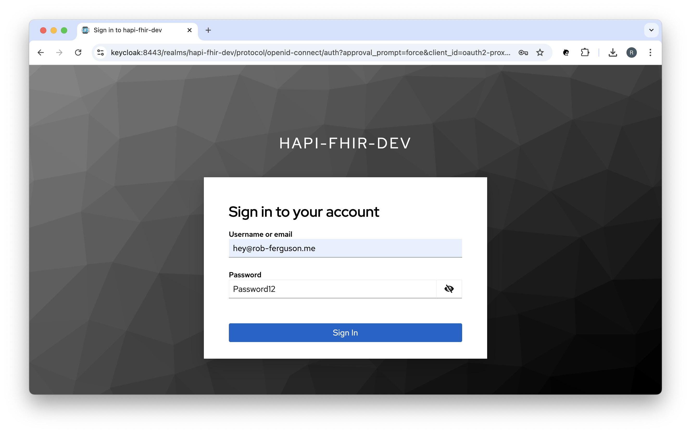
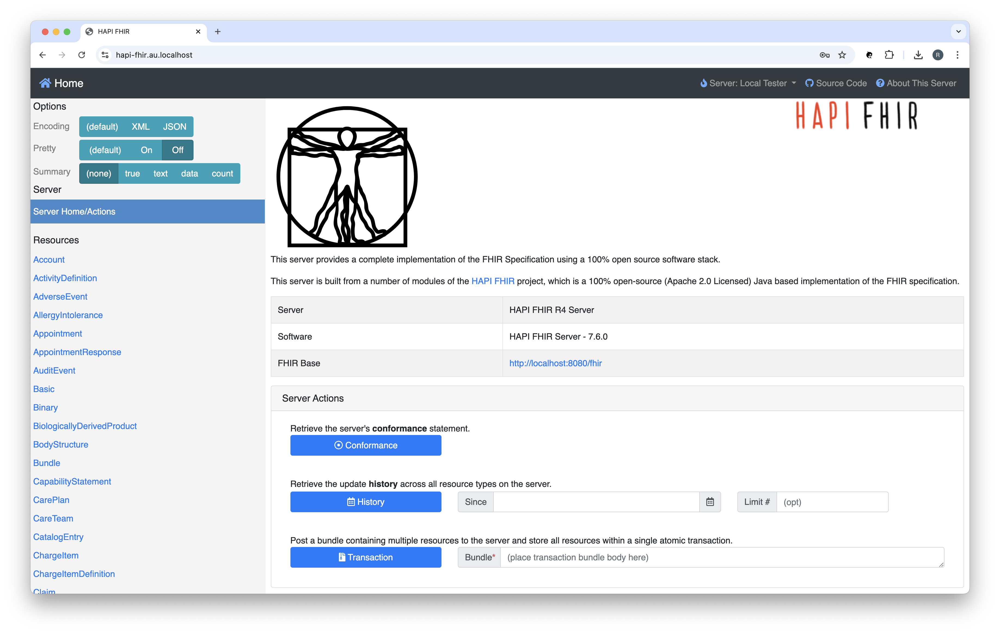
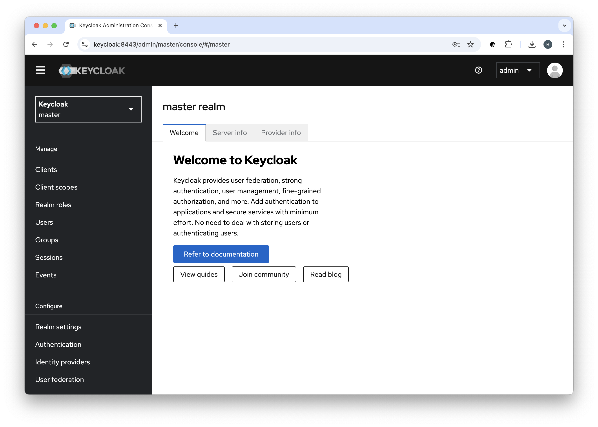
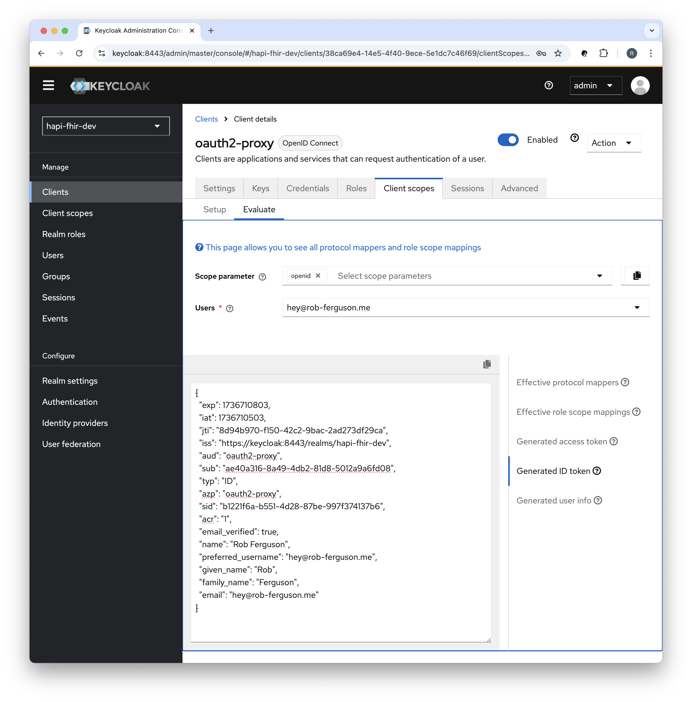
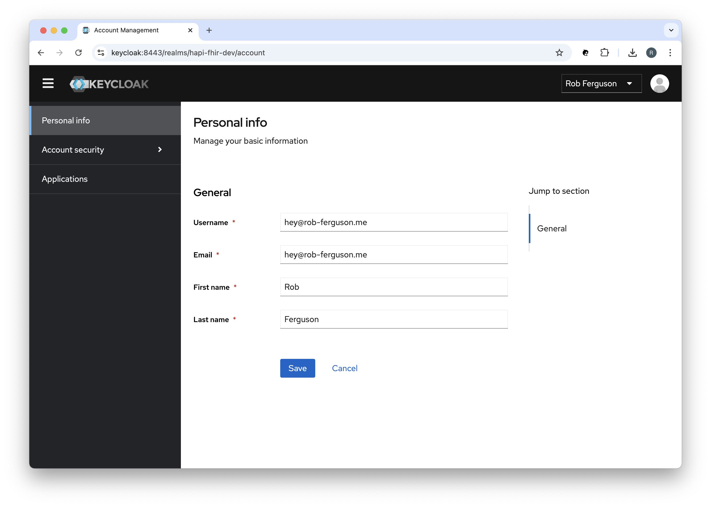

<p align="center">
  
</p>

<h1 align="center">HAPI FHIR AU with Auth Starter Project</h1>

<p align="center">
  <b>A sample HAPI FHIR with Auth Starter Project.</b> <br>
</p>

The goal of this project is to demonstrate secure access to FHIR resources in the form of OAuth 2.0-compliant 
authorisation (i.e., SMART on FHIR) and OpenID Connect authentication.


## ❯ Quick Start

### Clone the project

Change the current working directory to the location where you want the cloned project to be:

```
cd ~/workspace
```

Clone the project by running the following command:

```
git clone git@github.com:Robinyo/hapi-fhir-au.git
``` 

### Enable TLS

#### Local Development

Follow the steps in the project's Developer Documentation to use 
[mkcert](./backend/docs/developer/mkcert.md) to create and install a local certificate authority and to generate the 
certificates required to enable TLS.

### Docker Compose

With a single command, you can create and start all the services:

```
cd ~/workspace/hapi-fhir-au/backend
docker compose up
```

**Note:** Docker Compose will look for an `.env` file in the current working directory.

Navigate to:

```
https://hapi-fhir.au.localhost
```

You should see something like:

<p align="center">
  
</p>

Click the 'Sign in with OpenID Connect' button and sign in using the OpenID Connect (OIDC) **Authorization Code Flow**.

**Note:** You can skip this step if you set `OAUTH2_PROXY_SKIP_PROVIDER_BUTTON: true`

<p align="center">
  
</p>

Enter your username and password and then click the 'Sign In' button:

<p align="center">
  
</p>

Your connection is secure:

<p align="center">
  
</p>

#### Sign out

In the Keycloak Admin Console you can sign out of the session:

<p align="center">
  
</p>

Using the browser's Developer Tools you can clear the session cookie:

<p align="center">
  
</p>

The user will be prompted to Sign in again:

<p align="center">
  
</p>

#### OpenAPI (Swagger)

Navigate to the OpenAPI (Swagger) UI for the HAPI FHIR R4 Server:

```
https://hapi-fhir.au.localhost/fhir
```

You should see something like:

<p align="center">
  
</p>

**Note:** You can override the default FHIR Server Base URL, for example:

```
hapi:
  fhir:
    # server_address: http://localhost:8080/fhir
    server_address: https://hapi-fhir.au.localhost/fhir
```

See: [hapi.application.yaml](https://github.com/Robinyo/hapi-fhir-au/blob/main/backend/hapi.application.yaml)

To stop the services:

```
docker compose stop
```

To remove the services:

```
docker compose down
```

To remove the data volumes and network:

```
docker volume rm backend_postgres_data
docker volume rm backend_cache
docker network rm backend_hapi_network
```

### Call the FHIR API

##### OAuth 2.0 Client Credentials Grant

You must allow the 'Service account roles' capability config setting in order to enable support for the OAuth 2.0 **Client Credentials Grant**:

<p align="center">
  
</p>

#### Request a token

To access the API, you must request an access token. You will need to POST to the token URL.

For example (`scope=system/Patient.read`):

```
ACCESS_TOKEN=$(curl -s -X POST https://keycloak.au.localhost:8443/realms/hapi-fhir-dev/protocol/openid-connect/token \
  -H 'content-type: application/x-www-form-urlencoded' \
  -d grant_type=client_credentials \
  -d client_id=oauth2-proxy \
  -d client_secret=aHkRec1BYkfaKgMg164JmvKu8u9iWNHM \
  -d scope=system/Patient.read | (jq -r '.access_token'))
                 
# echo "$ACCESS_TOKEN"                 
```

**Note:** You can use [jwt.io](https://jwt.io/) to decode the access token.

#### Call the API

To call the API, an application must pass the access token as a Bearer token in the Authorization header of your HTTP request.

For example:

```
curl -X GET https://hapi-fhir.au.localhost/fhir/metadata \
  -H 'Content-Type: application/fhir+json' \
  -H "Authorization: Bearer $ACCESS_TOKEN"

curl -X GET https://hapi-fhir.au.localhost/fhir/Patient?_id=baratz-toni \
  -H 'Content-Type: application/fhir+json' \
  -H "Authorization: Bearer $ACCESS_TOKEN"
```

### Keycloak

#### Admin Console

To navigate to the Keycloak Admin Console (username: admin and password: secret):

```
https://keycloak.au.localhost:8443
```

You should see something like:

<p align="center">
  
</p>

You can preview tokens in the Keycloak Admin Console, for example:

<p align="center">
  
</p>

#### Account Console

To navigate to the Keycloak Account Console:

```
https://keycloak.au.localhost:8443/realms/hapi-fhir-dev/account
```

You should see something like:

<p align="center">
  
</p>

#### Realm Export

To export the `hapi-fhir-dev` realm to a single file (development-realm.json):

```
docker compose stop
docker compose -f docker-compose-keycloak-realm-export.yml up
docker compose -f docker-compose-keycloak-realm-export.yml stop
docker compose up
```

#### Realm Import

Keycloak will import the `hapi-fhir-dev` realm when it starts up:

```
  keycloak:
    container_name: keycloak
    
    ...

    command:
      [
        'start',
        '-Dkeycloak.migration.action=import',
        '-Dkeycloak.migration.provider=singleFile',
        '-Dkeycloak.migration.realmName=hapi-fhir-dev',
        '-Dkeycloak.migration.strategy=OVERWRITE_EXISTING',
        '-Dkeycloak.migration.file=/import/development-realm.json',
      ]
```

### Miscellaneous

Check the logs:

```
docker logs --tail 100 oauth2-proxy
docker logs --tail 100 keycloak
```

Clean and build:

```
docker system prune
docker compose build
```

Misc:

```
docker container ps -a
docker container ls
docker image ls
docker volume ls
```


## ❯ Resources

* Rob Ferguson's blog: [Getting Started with HAPI FHIR](https://rob-ferguson.me/getting-started-with-hapi-fhir/)
* Rob Ferguson's blog: [HAPI FHIR and FHIR Implementation Guides](https://rob-ferguson.me/hapi-fhir-and-fhir-implementation-guides/)
* Rob Ferguson's blog: [HAPI FHIR and AU Core Test Data](https://rob-ferguson.me/hapi-fhir-and-au-core-test-data/)
* Rob Ferguson's blog: [Add AuthN to HAPI FHIR with OAuth2 Proxy, Nginx and Keycloak - Part 1](https://rob-ferguson.me/add-authn-to-hapi-fhir-with-oauth2-proxy-nginx-and-keycloak-part-1/)
* Rob Ferguson's blog: [Add AuthN to HAPI FHIR with OAuth2 Proxy, Nginx and Keycloak - Part 2](https://rob-ferguson.me/add-authn-to-hapi-fhir-with-oauth2-proxy-nginx-and-keycloak-part-2/)
* Rob Ferguson's blog: [Add AuthN to HAPI FHIR with OAuth2 Proxy, Nginx and Keycloak - Part 3](https://rob-ferguson.me/add-authn-to-hapi-fhir-with-oauth2-proxy-nginx-and-keycloak-part-3/)
* Rob Ferguson's blog: [Add AuthN to HAPI FHIR with OAuth2 Proxy, Nginx and Keycloak - Part 4](https://rob-ferguson.me/add-authn-to-hapi-fhir-with-oauth2-proxy-nginx-and-keycloak-part-4/)
* Rob Ferguson's blog: [Add AuthZ to HAPI FHIR - Part 1](https://rob-ferguson.me/add-authz-to-hapi-fhir-1/)
* Rob Ferguson's blog: [Add AuthZ to HAPI FHIR - Part 2](https://rob-ferguson.me/add-authz-to-hapi-fhir-2/)

## ❯ References

### System Hardening

* Australian Signals Directorate: [Implementing Certificates, TLS, HTTPS and Opportunistic TLS](https://www.cyber.gov.au/resources-business-and-government/maintaining-devices-and-systems/system-hardening-and-administration/web-hardening/implementing-certificates-tls-https-and-opportunistic-tls)
* Cloudflare docs: [Cipher suites recommendations](https://developers.cloudflare.com/ssl/edge-certificates/additional-options/cipher-suites/recommendations/)

### OAuth 2.0

* IETF: [OAuth 2.0 for Browser-Based Applications](https://datatracker.ietf.org/doc/html/draft-ietf-oauth-browser-based-apps)
* Spring docs: [Implementation Guidelines for Browser-Based Applications](https://github.com/spring-projects/spring-authorization-server/issues/297#issue-896744390)
* okta Developer blog: [OAuth for Java Developers](https://developer.okta.com/blog/2022/06/16/oauth-java)
* OAuth.com: [OAuth 2.0 Playground](https://www.oauth.com/playground/?_gl=1*1fwid4n*_gcl_au*MjEyMTY2MzU4NS4xNzM1MDI2MjQ4*_ga*MTk3OTgwNDIxNS4xNzM1MDI2MjQ4*_ga_QKMSDV5369*MTczNjAyMjIyMS42LjEuMTczNjAyMjkyOS41Ny4wLjA.)

### SMART on FHIR

* HL7: [SMART App Launch](https://build.fhir.org/ig/HL7/smart-app-launch/)
* SMART Health IT: [SMART on FHIR](https://docs.smarthealthit.org/)

### HAPI FHIR

* HAPI FHIR: [Website](https://hapifhir.io/)
* HAPI FHIR: [Documentation](https://hapifhir.io/hapi-fhir/docs/)
* Google Group: [HAPI FHIR](https://groups.google.com/g/hapi-fhir)

### Keycloak

* Keycloak docs: [Configuring Keycloak for production](https://www.keycloak.org/server/configuration-production)
* Keycloak docs: [Configuring TLS](https://www.keycloak.org/server/enabletls)
* Keycloak docs: [Configuring trusted certificates](https://www.keycloak.org/server/keycloak-truststore)
* Keycloak docs: [Configuring the hostname](https://www.keycloak.org/server/hostname)
* Keycloak docs: [Using a reverse proxy](https://www.keycloak.org/server/reverseproxy)
* Keycloak docs: [Running Keycloak in a container](https://www.keycloak.org/server/containers)
* Keycloak docs: [Migrating to the Quarkus distribution](https://www.keycloak.org/migration/migrating-to-quarkus)
* Keycloak docs: [Upgrading Guide - 26.1.0](https://www.keycloak.org/docs/latest/upgrading/)
* Keycloak docs: [Authorization Services Guide](https://www.keycloak.org/docs/latest/authorization_services/index.html)

### Keycloak-based  Development

* GitHub: [Keycloak Project Example](https://github.com/thomasdarimont/keycloak-project-example)
* GitHub: [Awesome Keycloak](https://github.com/thomasdarimont/awesome-keycloak)

### Keycloak Support

* Google Group: [Keycloak User](https://groups.google.com/g/keycloak-user)
* Google Group: [Keycloak Dev](https://groups.google.com/g/keycloak-dev)

### okta

* okta Developer blog: [Add Auth to Any App with OAuth2 Proxy](https://developer.okta.com/blog/2022/07/14/add-auth-to-any-app-with-oauth2-proxy)
* okta forum: [SMART on FHIR wildcard scopes](https://devforum.okta.com/t/creating-wildcard-custom-scopes-for-oauth2/27418)
* GitHub: [Okta SMART on FHIR Setup Guide - scopes](https://github.com/oktadev/okta-smartfhir-docs/blob/original-v1-documentation/SETUP.md#scopes)

### Nginx

* Nginx docs: [NGINX SSL Termination](https://docs.nginx.com/nginx/admin-guide/security-controls/terminating-ssl-http/)
* Nginx docs: [Authentication Based on Subrequest Result](https://docs.nginx.com/nginx/admin-guide/security-controls/configuring-subrequest-authentication/)

### OAuth2 Proxy

* OAuth2 Proxy docs: [Integration](https://oauth2-proxy.github.io/oauth2-proxy/configuration/integration)
* OAuth2 Proxy docs: [TLS Configuration](https://oauth2-proxy.github.io/oauth2-proxy/configuration/tls/)

### Clinical Information Systems

* Oracle Health Millennium Platform: [Authorization Framework](https://docs.oracle.com/en/industries/health/millennium-platform-apis/fhir-authorization-framework/#authorization)
