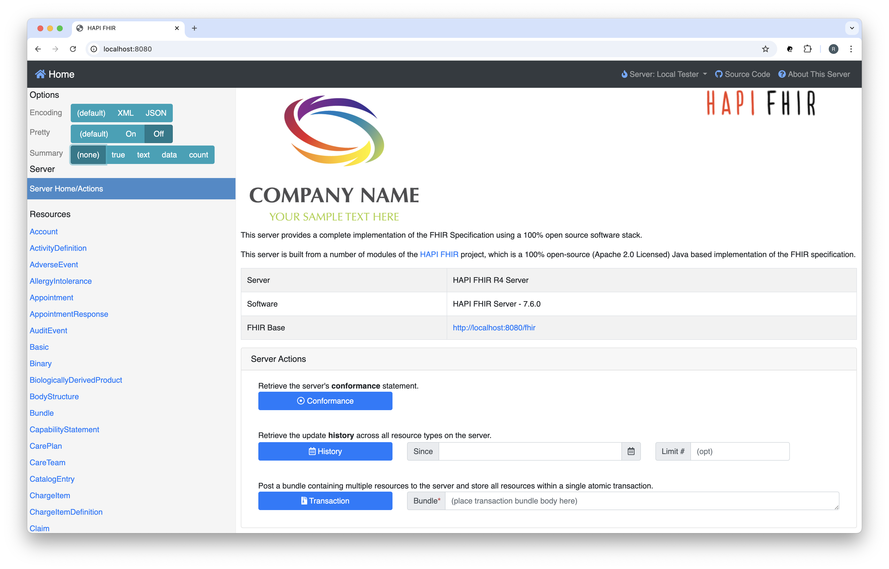

## ❯ Quick Start Guide

### Clone the project

Change the current working directory to the location where you want the cloned project to be:

```
cd ~/workspace
```

Clone the project by running the following command:

```
git clone git@github.com:Robinyo/hapi-fhir-au.git

``` 

### Docker Compose

With a single command, you can create and start all the services:

```
# ./.env
cd ~/workspace/hapi-fhir-au/backend
docker compose up
```

**Note:** Docker Compose will look for a `.env` file in the current working directory.

Navigate to the HAPI FHIR **Welcome** page: 

```
http://localhost:4180
```

You should see something like:

<p align="center">
  
</p>

Navigate to the Keycloak Administrator console:

```
http://localhost:5001
```

To stop the services:

```
docker compose stop
```

To remove the services:

```
docker compose down
```

To remove the data volume:

```
docker volume rm backend_postgres_data
docker volume rm backend_cache
```

### Miscellaneous 

#### Export

Export:

```
docker compose -f docker-compose-keycloak-realm-export.yml up
docker compose -f docker-compose-keycloak-realm-export.yml stop
docker compose -f docker-compose-keycloak-realm-export.yml down
docker volume rm backend_postgres_data
docker volume rm backend_cache
```

Check the logs:

```
docker logs --tail 100 keycloak
docker logs --tail 100 oauth2-proxy
```

Clean and build:

```
docker system prune
docker compose build
```

Misc:

```
docker container ps -a

docker image ls
```

